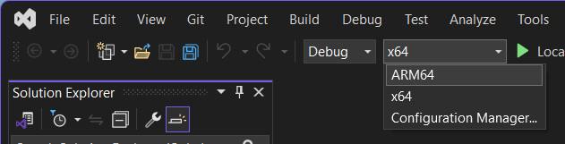

アドビは、Arm 上の Windows でネイティブに実行される一部の製品で Windows on Arm エフェクトプラグインをサポートするようになりました。たとえば、After Effects エフェクトプラグインは、Adobe Premiere Pro や Adob​​e Media Encoder でも利用できます。

すべての Adob​​e 製品に Windows on Arm のネイティブ バージョンがまだあるわけではありませんが、ネイティブの Windows on Arm バージョンがある製品では、Windows on Arm 実装のエフェクトプラグインのみが利用可能になります。これらの新しい Windows on Arm マシンの急速な普及を見越して、Windows on Arm ターゲットをすぐに追加することをお勧めします。

:::note
Windows on Arm バイナリをビルドするには、Visual Studio 17.4 以降が必要です。

:::
Windows on Arm サポートの追加の詳細については、[https://learn.microsoft.com/en-us/windows/arm/add-arm-support](https://learn.microsoft.com/en-us/windows/arm/add-arm-support) をご覧ください。

---

## プラグインの Windows on Arm サポートを追加する方法

1. プラグインの Visual Studio ソリューションをバージョン 17.4 以降で開き、ARM64 ターゲットを選択します。

    
    *Visual Studio ARM64 ターゲット*

2. After Effects に Windows on Arm ビルドのメイン エントリ ポイントを伝えます。

    > * プラグインの .r リソース ファイルを見つけます。
    > * 既存の Windows on Intel エントリ ポイント定義の横に `CodeWinARM64 {"EffectMain"}` を追加します。
    >「cpp」
    > #定義されている場合(AE_OS_WIN)
    > CodeWinARM64 {"EffectMain"},
    > CodeWin64X86 {"EffectMain"},
    > #endif
    >「」
    > * 何らかの理由で Intel と Arm に異なるエントリ ポイントが必要な場合は、別のエントリ ポイント名と文字列を指定するだけです。

3. ARM64 ターゲット用にビルドして Windows on Arm バイナリをコンパイルします。

Windows on Arm ビルドにコンパイル時間の問題がないと仮定すると、Windows on Arm ネイティブ製品でバイナリを使用できるようになります。

```
